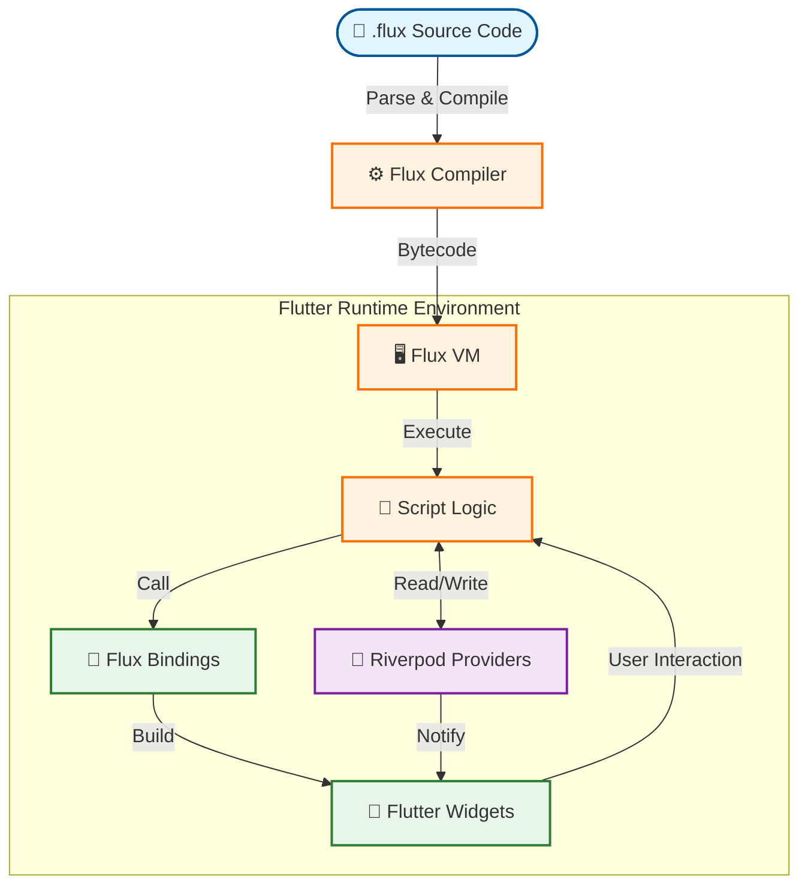

# Flux ⚡

[漢文文檔](README_ZH.md)

[](https://github.com/ImL1s/flux)
[](https://github.com/ImL1s/flux/actions)

> **A Dynamic Scripting Language for Flutter Server-Driven UI**

Flux is a lightweight, stack-based scripting language designed specifically to enable **dynamic updates** and **server-driven UI** logic within Flutter applications. It decouples business logic and UI layout from the app binary, allowing for instant updates without App Store submission.

### 🆕 What's New in v2.0.0
- **FluxUI Component Library**: Complete set of UI components (Button, Card, Input, Badge, Row, Column, Grid, Stack)
- **BLE Integration**: Full Bluetooth Low Energy support via `flutter_blue_plus`
- **Camera Integration**: Real camera functionality via `camera` package
- **Enhanced CLI**: Project scaffolding, hot-reload, and static analysis

---

## 🏗️ Architecture (The "HERO" Flow)

This diagram illustrates how Flux transforms raw script code into a reactive native Flutter UI interactively managed by Riverpod.



1.  **Compiler**: Translates human-readable `.flux` code into efficient bytecode instructions.
2.  **VM**: A stack-based virtual machine that executes the bytecode safely within the host app.
3.  **Bindings**: Bridges the gap between the dynamic VM and static Flutter widgets (Text, Column, etc.).
4.  **Riverpod**: Acts as the synchronized state layer, allowing Flux scripts to read/write native Flutter state seamlessly.

---

## 📦 Packages Overview

The project is organized as a monorepo containing the following core packages:

| Package | Description | pub.dev |
|---------|-------------|---------|
| **[`flux_compiler`](packages/flux_compiler)** | Lexer, Parser, and Code Generator. Converts source to bytecode. | [](https://pub.dev/packages/flux_compiler) |
| **[`flux_vm`](packages/flux_vm)** | The runtime engine. A stack machine that executes Flux bytecode. | [](https://pub.dev/packages/flux_vm) |
| **[`flux_flutter`](packages/flux_flutter)** | Flutter integration layer. Contains widget bindings and the Riverpod runtime adapter. | [](https://pub.dev/packages/flux_flutter) |
| **[`flux_lang_cli`](packages/flux_cli)** | Command-line tool for running `.flux` scripts directly in the terminal. | [](https://pub.dev/packages/flux_lang_cli) |
| **[`flux_lsp`](packages/flux_lsp)** | Language Server Protocol (LSP) implementation for editor intelligence. | [](https://pub.dev/packages/flux_lsp) |
| **[`flux_vscode`](packages/flux_vscode)** | VSCode Extension providing syntax highlighting, snippets, and LSP integration. | - |
| **[`flux_updater`](packages/flux_updater)** | OTA update system with bytecode diff and version control. | [](https://pub.dev/packages/flux_updater) |

---

## 🚀 Getting Started

### 1. Installation

Add Flux to your `pubspec.yaml`:

```yaml
dependencies:
  flux_flutter: ^2.0.1
  flutter_riverpod: ^3.0.0
```

Install from pub.dev:
```bash
flutter pub add flux_flutter
```

Or for local development:
```yaml
dependencies:
  flux_flutter:
    path: ../packages/flux_flutter
```

### 2. Writing a Flux Script

Create a file named `counter.flux`:

```javascript
// Define a widget component
widget Counter {
  state count = 0;
  
  build {
    Column(
      children: [
        Text(text: "Count: " + count),
        Button(
          text: "Increment",
          onPressed: fn() {
            count = count + 1;
          }
        )
      ]
    )
  }
}
```

### 3. Integrating in Flutter

```dart
// 1. Define your State
final counterProvider = NotifierProvider<FluxValueNotifier<int>, int>(
  () => FluxValueNotifier(0),
);

// 2. Use the FluxWidget
class MyApp extends StatelessWidget {
  @override
  Widget build(BuildContext context) {
    return Scaffold(
      body: FluxWidget(
        source: fluxSourceCode, // Load your .flux file string here
        widgetName: 'Counter',  // The widget class implementation to use
      ),
    );
  }
}
```

---

## 🌟 Key Features

*   **Hot-Pushable Logic**: Update UI structure and business rules by simply downloading a new string.
*   **Sandboxed Execution**: Scripts run in a controlled VM environment, preventing crashes in the host app.
*   **Native Performance**: Uses lightweight bytecode interpretation, keeping the UI smooth (60fps).
*   **State Management**: First-class support for **Riverpod** 3.x/2.x via the Notifier API.

---

# Tooling & IDE Support

### VSCode Extension
The **Flux VSCode Extension** provides a premium development experience:
- **Intelligent Navigation**: Go to Definition and Find All References.
- **Code Intelligence**: Autocompletion for widgets, keywords, and providers.
- **Diagnostics**: Real-time error reporting as you type.
- **Snippets**: Rapidly scaffold widgets and logic blocks.

To install, see the [VSCode Extension README](packages/flux_vscode/README.md).

### Command-Line Interface (CLI)

The Flux CLI provides tools for development and deployment:

```bash
# Install globally
cd packages/flux_cli && dart pub global activate --source path .

# Create a new project
flux create my_app --template flutter

# Run with hot-reload
flux run main.flux --watch

# Static analysis
flux analyze ./src/

# Build to bytecode
flux build script.flux
```

For complete documentation, see [Flux CLI README](packages/flux_cli/README.md).

---

## 📚 Documentation

- **[Language Guide](docs/LANGUAGE_GUIDE.md)**: Syntax, control flow, functions, and native interop.
- **[Widget Catalog](docs/WIDGET_CATALOG.md)**: List of all supported Flutter widgets.
- **[Flux vs Lua](docs/COMPARISON.md)**: Comparison with Lua hot update solutions.
- **[Lua Migration Guide](docs/lua_migration.md)**: For developers migrating from Lua.
- **[Chinese Quick Start](docs/README.md)**: 30-second quick start guide in Chinese.

---

## 🛠️ Development

### Running Tests

To ensure the integrity of the ecosystem, run the test suite across all packages:

```bash
# Core Logic Tests
dart test packages/flux_compiler
dart test packages/flux_vm
dart test packages/flux_cli
dart test packages/flux_lsp

# Integration Tests
flutter test packages/flux_flutter
```
