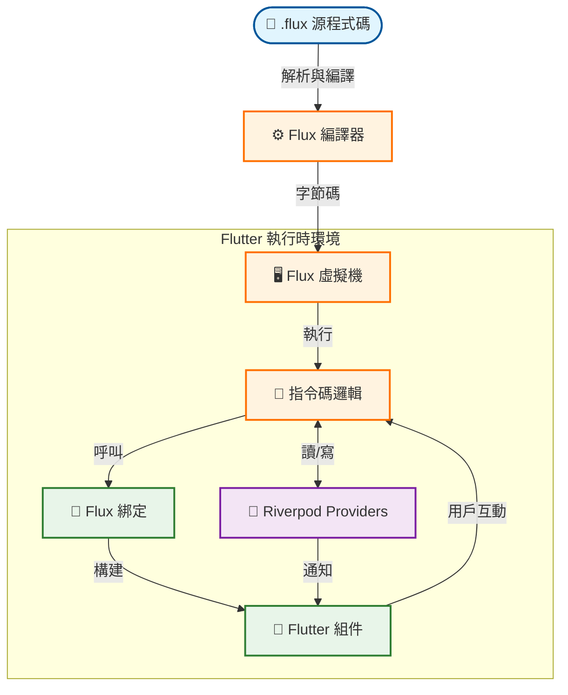

# Flux ⚡

[](https://github.com/ImL1s/flux)
[](https://github.com/ImL1s/flux/actions)

> **用於 Flutter 服務端驅動 UI (Server-Driven UI) 的動態指令碼語言**

Flux 是一種輕量級、基於棧 (stack-based) 的指令碼語言，專為在 Flutter 應用程式中實現 **動態更新** 和 **服務端驅動 UI** 邏輯而設計。它將業務邏輯和 UI 佈局從應用程式二進位制檔案中解耦，允許在不經過 App Store 稽核的情況下進行即時更新。

### 🆕 v2.0.0 新特性
- **FluxUI 元件庫**：全套 UI 元件（Button, Card, Input, Badge, Row, Column, Grid, Stack）
- **BLE 整合**：透過 `flutter_blue_plus` 提供完整的藍牙低功耗支援
- **相機整合**：透過 `camera` 套件實現真實相機功能
- **增強型 CLI**：專案腳手架、熱重載加密靜態分析

---

## 🏗️ 架構（"HERO" 流程）

此圖展示了 Flux 如何將原始指令碼程式碼轉換為由 Riverpod 互動管理的響應式原生 Flutter UI。



1.  **編譯器 (Compiler)**：將人類可讀的 `.flux` 程式碼翻譯成高效的字節碼指令。
2.  **虛擬機 (VM)**：一個基於棧的虛擬機，在宿主應用中安全地執行字節碼。
3.  **綁定 (Bindings)**：橋接動態虛擬機與靜態 Flutter 組件（Text, Column 等）之間的鴻溝。
4.  **Riverpod**：作為同步狀態層，允許 Flux 指令碼無縫地讀取/寫入原生 Flutter 狀態。

---

## 📦 套件概覽

本專案以 monorepo 形式組織，包含以下核心套件：

| 套件 | 描述 | pub.dev |
|---------|-------------|---------|
| **[`flux_compiler`](packages/flux_compiler)** | 詞法分析器、語法分析器和程式碼生成器。將源檔案轉換為字節碼。 | [](https://pub.dev/packages/flux_compiler) |
| **[`flux_vm`](packages/flux_vm)** | 執行時引擎。執行 Flux 字節碼的棧式虛擬機。 | [](https://pub.dev/packages/flux_vm) |
| **[`flux_flutter`](packages/flux_flutter)** | Flutter 整合層。包含組件綁定和 Riverpod 執行時適配器。 | [](https://pub.dev/packages/flux_flutter) |
| **[`flux_lang_cli`](packages/flux_cli)** | 用於在終端直接執行 `.flux` 指令碼的命令行工具。 | [](https://pub.dev/packages/flux_lang_cli) |
| **[`flux_lsp`](packages/flux_lsp)** | 用於編輯器智慧化的語言伺服器協議 (LSP) 實現。 | [](https://pub.dev/packages/flux_lsp) |
| **[`flux_vscode`](packages/flux_vscode)** | 提供語法高亮、程式碼片段和 LSP 整合的 VSCode 擴充功能。 | - |
| **[`flux_updater`](packages/flux_updater)** | 具有字節碼差異對比和版本控制的 OTA 更新系統。 | [](https://pub.dev/packages/flux_updater) |

---

## 🚀 快速入門

### 1. 安裝

在您的 `pubspec.yaml` 中添加 Flux：

```yaml
dependencies:
  flux_flutter: ^2.0.1
  flutter_riverpod: ^3.0.0
```

從 pub.dev 安裝：
```bash
flutter pub add flux_flutter
```

或是用於本地開發：
```yaml
dependencies:
  flux_flutter:
    path: ../packages/flux_flutter
```

### 2. 編寫 Flux 指令碼

建立一個名為 `counter.flux` 的檔案：

```javascript
// 定義一個組件
widget Counter {
  state count = 0;
  
  build {
    Column(
      children: [
        Text(text: "次數: " + count),
        Button(
          text: "增加",
          onPressed: fn() {
            count = count + 1;
          }
        )
      ]
    )
  }
}
```

### 3. 在 Flutter 中整合

```dart
// 1. 定義您的狀態
final counterProvider = NotifierProvider<FluxValueNotifier<int>, int>(
  () => FluxValueNotifier(0),
);

// 2. 使用 FluxWidget
class MyApp extends StatelessWidget {
  @override
  Widget build(BuildContext context) {
    return Scaffold(
      body: FluxWidget(
        source: fluxSourceCode, // 在此載入您的 .flux 檔案字串
        widgetName: 'Counter',  // 要使用的組件實現名稱
      ),
    );
  }
}
```

---

## 🌟 核心特性

*   **可熱推送邏輯**：只需下載一個新字串即可更新 UI 結構和業務規則。
*   **沙箱執行**：指令碼在受控的虛擬機環境中執行，防止宿主應用崩潰。
*   **原生性能**：使用輕量級字節碼解釋，保持 UI 流暢 (60fps)。
*   **狀態管理**：透過 Notifier API 對 **Riverpod** 3.x/2.x 提供一流支援。

---

# 工具與 IDE 支援

### VSCode 擴充功能
**Flux VSCode Extension** 提供優質的開發體驗：
- **智慧導航**：跳轉到定義和查詢所有引用。
- **程式碼智慧化**：針對組件、關鍵字和 provider 的自動補全。
- **診斷功能**：鍵入時即時回報錯誤。
- **程式碼片段**：快速構建組件和邏輯塊的腳手架。

安裝請參閱 [VSCode 擴充功能 README](packages/flux_vscode/README_ZH.md)。

### 命令行介面 (CLI)

Flux CLI 提供開發和部署工具：

```bash
# 全域安裝
cd packages/flux_cli && dart pub global activate --source path .

# 建立新專案
flux create my_app --template flutter

# 使用熱重載執行
flux run main.flux --watch

# 靜態分析
flux analyze ./src/

# 編譯為字節碼
flux build script.flux
```

完整文檔請參閱 [Flux CLI README](packages/flux_cli/README_ZH.md)。

---

## 📚 文檔

- **[語言指南](docs/LANGUAGE_GUIDE_ZH.md)**：語法、控制流、函式和原生互操作。
- **[組件目錄](docs/WIDGET_CATALOG_ZH.md)**：所有受支援組件的列表。
- **[Flux vs Lua](docs/COMPARISON_ZH.md)**：與 Lua 熱更新方案的比較。
- **[Lua 遷移指南](docs/lua_migration_ZH.md)**：為從 Lua 遷移過來的開發者準備。
- **[中文快速入門](docs/getting_started_ZH.md)**：30 秒中文快速入門指南。

---

## 🛠️ 開發

### 執行測試

為了確保生態系統的完整性，請在所有套件中執行測試套件：

```bash
# 核心邏輯測試
fvm dart test packages/flux_compiler
fvm dart test packages/flux_vm
fvm dart test packages/flux_cli
fvm dart test packages/flux_lsp

# 整合測試
fvm flutter test packages/flux_flutter
```
