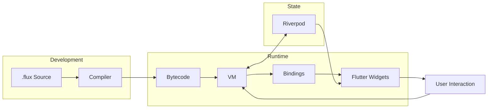

# Flux Architecture

Flux is a multi-component system designed to enable **Server-Driven UI** for Flutter with a reactive scripting capability. This document provides an in-depth overview of the system architecture.

## High-Level Data Flow



## Repository Structure

The monorepo consists of the following packages:

### Core Packages

| Package | Description |
|---------|-------------|
| `flux_compiler` | Lexer, Parser, AST, Optimizer, and Bytecode Generator |
| `flux_vm` | Stack-based Virtual Machine with coroutine support |
| `flux_flutter` | Flutter integration: widgets, bindings, and Riverpod adapter |

### Tooling Packages

| Package | Description |
|---------|-------------|
| `flux_cli` | Command-line interface for running and analyzing scripts |
| `flux_lsp` | Language Server Protocol for IDE intelligence |
| `flux_dap` | Debug Adapter Protocol for VS Code debugging |
| `flux_vscode` | VS Code extension with syntax highlighting and snippets |
| `flux_updater` | OTA update system with diff-based patching |
| `flux_devtools_extension` | Flutter DevTools integration |

## Package Details

### flux_compiler

The front-end of the Flux language:

- **Lexer** (`lexer.dart`): Tokenizes source code into tokens
- **Parser** (`parser.dart`): Builds Abstract Syntax Tree (AST) from tokens
- **AST** (`ast.dart`): Node definitions for expressions, statements, and declarations
- **Compiler** (`compiler.dart`): Emits bytecode instructions with source maps
- **Optimizer** (`optimizer.dart`): Constant folding, dead code elimination

### flux_vm

The runtime environment:

- **VM** (`vm.dart`): Stack-based virtual machine executing bytecode
- **Coroutine** (`coroutine.dart`): Async/await support with suspendable execution
- **Closure** (`closure.dart`): First-class function support with captured upvalues
- **Stdlib** (`stdlib.dart`): Standard library (print, math, string operations)
- **FluxModule**: Extension point for native module integration

### flux_flutter

The Flutter integration layer:

- **FluxWidget**: Bridge between Flutter widget tree and Flux VM
- **FluxRuntime**: Manages VM lifecycle and widget rendering
- **Bindings** (`bindings.dart`): Maps 50+ Flutter widgets to Flux functions
- **Riverpod Integration**: Bi-directional state synchronization
- **Security** (`security.dart`): ED25519 script signing and verification
- **Modules**: HTTP, BLE, Camera, Animation, Storage, Persistence

## Compilation Flow

```
┌─────────────────┐    ┌─────────────────┐    ┌─────────────────┐
│   .flux Source  │───▶│     Lexer       │───▶│     Tokens      │
└─────────────────┘    └─────────────────┘    └─────────────────┘
                                                       │
                                                       ▼
┌─────────────────┐    ┌─────────────────┐    ┌─────────────────┐
│  CompiledFunc   │◀───│    Compiler     │◀───│      AST        │
│  (Bytecode)     │    │                 │    │                 │
└─────────────────┘    └─────────────────┘    └─────────────────┘
         │
         ▼
┌─────────────────┐    ┌─────────────────┐    ┌─────────────────┐
│       VM        │───▶│    Bindings     │───▶│  Flutter Widget │
│  (Execution)    │    │                 │    │      Tree       │
└─────────────────┘    └─────────────────┘    └─────────────────┘
```

## State Management

Flux integrates with Flutter's reactive paradigm:

1. **FluxWidget** creates a `VM` instance and compiles the source
2. **VM** executes the `build` block, calling widget bindings
3. State variables declared with `state` keyword trigger reactivity
4. When state changes, `onStateChange` callback is triggered
5. **FluxWidget** calls `setState()`, rebuilding the Flutter subtree
6. **Riverpod** providers can be read/written from Flux scripts

### Persistence

State can be persisted automatically:

```flux
widget Counter {
  persistent count = 0;  // Auto-saved to Hive
  
  build {
    Text("Count: " + count)
  }
}
```

## Security (Production)

### Script Signing

- **ED25519**: Scripts are cryptographically signed with ED25519
- **Hash Verification**: SHA-256 content hash prevents tampering
- **FluxSignatureVerifier**: Validates signatures before execution

### Sandboxing

`FluxSandboxConfig` enforces runtime limits:

| Limit | Default | Description |
|-------|---------|-------------|
| `maxExecutionTimeMs` | 30,000 | Maximum script execution time |
| `maxStackDepth` | 64 | Maximum call stack depth |
| `maxStringLength` | 1 MB | Maximum string allocation |
| `maxCollectionSize` | 10,000 | Maximum list/map items |
| `allowedHosts` | `[]` | Whitelisted network hosts |

### Version Management

- **FluxVersionManager**: Caches multiple script versions
- **Rollback Support**: Instant fallback to previous versions
- **OTA Updates**: Differential updates with `flux_updater`

## Extension Points

### Custom Modules

Register native functionality via `FluxModule`:

```dart
class MyModule implements FluxModule {
  @override
  String get name => 'myModule';
  
  @override
  Object? get(String name) {
    switch (name) {
      case 'doSomething':
        return (List<Object?> args) => /* native code */;
    }
    return null;
  }
}

vm.registerModule(MyModule());
```

### Custom Widget Bindings

Extend `FluxBindings` to add new widgets:

```dart
bindings.register('MyCustomWidget', (args, children, runtime) {
  return MyCustomWidget(
    title: args['title'] as String?,
    child: children.isNotEmpty ? children.first : null,
  );
});
```

## Development Workflow

### Hot Reload

1. Run `flux run script.flux --watch`
2. Edit `.flux` file
3. Changes are pushed via WebSocket
4. UI updates instantly without app restart

### Debugging

1. Set breakpoints in VS Code
2. DAP server (`flux_dap`) handles debug protocol
3. Step through Flux code with variable inspection
4. Source maps link bytecode to original source

## Performance Characteristics

- **Bytecode Compilation**: ~1ms for typical scripts
- **VM Execution**: ~10x slower than native Dart (acceptable for UI logic)
- **Widget Binding**: Direct Flutter widget instantiation
- **Memory**: Minimal overhead with stack-based execution
- **Inline Caching**: Optimized property access patterns
