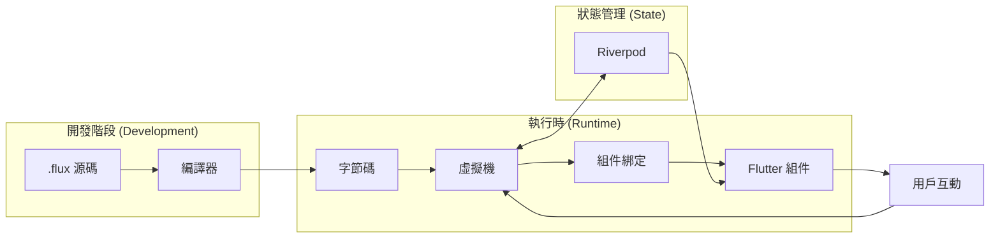

# Flux 架構設計

Flux 是一個多組件系統，旨在為 Flutter 提供具有響應式指令碼功能的 **服務端驅動 UI (Server-Driven UI)**。本文件提供系統架構的深度概覽。

## 高層資料流



## 倉庫結構 (Repository Structure)

本 monorepo 由以下套件組成：

### 核心套件 (Core Packages)

| 套件 | 描述 |
|---------|-------------|
| `flux_compiler` | 詞法分析器、語法分析器、AST、優化器和字節碼生成器 |
| `flux_vm` | 具有協程支援的棧式虛擬機 (Stack-based Virtual Machine) |
| `flux_flutter` | Flutter 整合：組件、組件綁定和 Riverpod 適配器 |

### 工具套件 (Tooling Packages)

| 套件 | 描述 |
|---------|-------------|
| `flux_cli` | 用於執行和分析指令碼的命令行介面 |
| `flux_lsp` | 用於 IDE 智慧化的語言伺服器協議 (LSP) |
| `flux_dap` | 用於 VS Code 除錯的除錯適配器協議 (DAP) |
| `flux_vscode` | 具有語法高亮和程式碼片段的 VS Code 擴充功能 |
| `flux_updater` | 具有基於差異路徑更新的 OTA 更新系統 |
| `flux_devtools_extension` | Flutter DevTools 整合插件 |

## 套件細節

### flux_compiler

Flux 語言的前端部分：

- **詞法分析器** (`lexer.dart`)：將源程式碼標記化為 Token。
- **語法分析器** (`parser.dart`)：從 Token 構建抽象語法樹 (AST)。
- **抽象語法樹** (`ast.dart`)：表示式、語句和聲明的節點定義。
- **編譯器** (`compiler.dart`)：生成帶有源碼映射 (Source Maps) 的字節碼指令。
- **優化器** (`optimizer.dart`)：常數摺疊、死碼消除。

### flux_vm

執行時環境：

- **虛擬機 (VM)** (`vm.dart`)：執行字節碼的棧式虛擬機。
- **協程 (Coroutine)** (`coroutine.dart`)：支援懸掛執行的 async/await 機制。
- **閉包 (Closure)** (`closure.dart`)：一等函式支援，具有擷取的向上值 (upvalues)。
- **標準庫 (Stdlib)** (`stdlib.dart`)：標準庫（列印、數學、字串操作）。
- **FluxModule**：用於原生模組整合的擴充點。

### flux_flutter

Flutter 整合層：

- **FluxWidget**：Flutter 組件樹與 Flux 虛擬機之間的橋樑。
- **FluxRuntime**：管理虛擬機生命週期和組件渲染。
- **組件綁定 (Bindings)** (`bindings.dart`)：將 50+ 個 Flutter 組件映射到 Flux 函式。
- **Riverpod 整合**：雙向狀態同步。
- **安全性 (Security)** (`security.dart`)：ED25519 指令碼簽名與驗證。
- **模組**：HTTP, BLE, 相機, 動畫, 儲存, 持久化。

## 編譯流程

```
┌─────────────────┐    ┌─────────────────┐    ┌─────────────────┐
│   .flux 源原始碼  │───▶│   詞法分析器    │───▶│     Tokens      │
└─────────────────┘    └─────────────────┘    └─────────────────┘
                                                        │
                                                        ▼
┌─────────────────┐    ┌─────────────────┐    ┌─────────────────┐
│ 編譯後的函式    │◀───│    編譯器       │◀───│      AST        │
│  (字節碼)       │    │                 │    │                 │
└─────────────────┘    └─────────────────┘    └─────────────────┘
         │
         ▼
┌─────────────────┐    ┌─────────────────┐    ┌─────────────────┐
│     虛擬機      │───▶│    組件綁定     │───▶│  Flutter 組件樹 │
│     (執行)      │    │                 │    │                 │
└─────────────────┘    └─────────────────┘    └─────────────────┘
```

## 狀態管理

Flux 與 Flutter 的響應式範式整合：

1. **FluxWidget** 建立一個 `VM` 實例並編譯源碼。
2. **虛擬機** 執行 `build` 區塊，呼叫組件綁定。
3. 使用 `state` 關鍵字聲明的狀態變數會觸發響應性。
4. 當狀態改變時，會觸發 `onStateChange` 回呼。
5. **FluxWidget** 呼叫 `setState()`，重新構建 Flutter 子樹。
6. Flux 指令碼可以讀取/寫入 **Riverpod** providers。

### 持久化 (Persistence)

狀態可以自動持久化：

```flux
widget Counter {
  persistent count = 0;  // 自動儲存到 Hive
  
  build {
    Text("計數: " + count)
  }
}
```

## 安全性（生產環境）

### 指令碼簽名

- **ED25519**：指令碼使用 ED25519 進行加密簽名。
- **哈希驗證 (Hash Verification)**：SHA-256 內容哈希防止篡改。
- **FluxSignatureVerifier**：在執行前校驗簽名。

### 沙箱機制 (Sandboxing)

`FluxSandboxConfig` 強制執行執行時限制：

| 限制項目 | 預設值 | 描述 |
|-------|---------|-------------|
| `maxExecutionTimeMs` | 30,000 | 最大指令碼執行時間 |
| `maxStackDepth` | 64 | 最大呼叫棧深度 |
| `maxStringLength` | 1 MB | 最大字串分配大小 |
| `maxCollectionSize` | 10,000 | 列表/映射最大項數 |
| `allowedHosts` | `[]` | 網路主機白名單 |

### 版本管理

- **FluxVersionManager**：快取多個指令碼版本。
- **回滾支援 (Rollback Support)**：即時回滾到以前的版本。
- **OTA 更新**：使用 `flux_updater` 進行增量更新。

## 擴充點

### 自定義模組 (Custom Modules)

透過 `FluxModule` 註冊原生功能：

```dart
class MyModule implements FluxModule {
  @override
  String get name => 'myModule';
  
  @override
  Object? get(String name) {
    switch (name) {
      case 'doSomething':
        return (List<Object?> args) => /* 原生程式碼 */;
    }
    return null;
  }
}

vm.registerModule(MyModule());
```

### 自定義組件綁定

擴充 `FluxBindings` 以添加新組件：

```dart
bindings.register('MyCustomWidget', (args, children, runtime) {
  return MyCustomWidget(
    title: args['title'] as String?,
    child: children.isNotEmpty ? children.first : null,
  );
});
```

## 開發流程

### 熱重載 (Hot Reload)

1. 執行 `flux run script.flux --watch`
2. 編輯 `.flux` 檔案
3. 更改透過 WebSocket 推送
4. UI 即時更新，無需重啟應用

### 除錯 (Debugging)

1. 在 VS Code 中設定斷點
2. DAP 伺服器 (`flux_dap`) 處理除錯協議
3. 單步執行具有變數檢查的 Flux 程式碼
4. 源碼映射將字節碼連結回原始源碼

## 性能特性

- **字節碼編譯**：典型指令碼約 ~1ms
- **虛擬機執行**：比原生 Dart 慢 ~10 倍（對於 UI 邏輯可以接受）
- **組件綁定**：直接進行 Flutter 組件實例化
- **記憶體**：基於棧的執行，開銷極小
- **內聯快取 (Inline Caching)**：優化的屬性訪問模式
