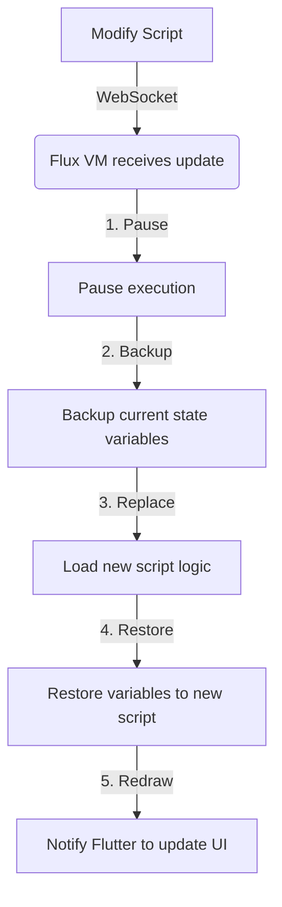

# Flutter Integration Guide

[漢文文檔](flutter_integration_ZH.md)

This guide will teach you how to embed and use Flux scripts in your Flutter application.

## 1. Installation & Setup

Add dependencies to your Flutter project's `pubspec.yaml`:

```yaml
dependencies:
  flutter:
    sdk: flutter
  # Add Flux dependencies
  flux_vm: ^1.0.0
  flux_flutter: ^1.0.0
```

Then run:
```bash
flutter pub get
```

---

## 2. Basic Usage (FluxWidget)

`FluxWidget` is the core component used to render Flux code within the Flutter interface.

### Display Simple Text

```dart
import 'package:flutter/material.dart';
import 'package:flux_flutter/flux_flutter.dart';

class MyScreen extends StatelessWidget {
  @override
  Widget build(BuildContext context) {
    return Scaffold(
      appBar: AppBar(title: Text("Flux Example")),
      body: Center(
        child: FluxWidget(
          // Define Flux Widget name
          widgetName: 'Greeting',
          // Flux source code
          source: '''
            widget Greeting {
              build {
                return Text("Hello, Flutter!");
              }
            }
          ''',
        ),
      ),
    );
  }
}
```

---

## 3. State Management

Flux has its own state management system. When a `state` variable changes, the UI updates automatically.

### Counter Example

```dart
FluxWidget(
  widgetName: 'Counter',
  source: '''
    widget Counter {
      // Define state variable
      state count = 0;
      
      build {
        return Column(
          children: [
            Text("Current count: " + count),
            
            // Buttons trigger state changes
            Row(
              children: [
                Button(
                  text: "Increment",
                  onTap: fn() { 
                    count = count + 1; 
                  }
                ),
                Button(
                  text: "Decrement",
                  onTap: fn() { 
                    count = count - 1; 
                  }
                )
              ]
            )
          ]
        );
      }
    }
  ''',
)
```

---

## 4. Supported Widgets

Flux currently supports several basic Flutter widgets:

| Flux Widget | Equivalent Flutter | Property Example |
|-----------|--------------|----------|
| `Text` | `Text` | `text: "Hello"`, `style: {...}` |
| `Button` | `ElevatedButton` | `text: "Press me"`, `onTap: fn() {...}` |
| `Column` | `Column` | `children: [...]` |
| `Row` | `Row` | `children: [...]` |
| `Container` | `Container` | `padding: 10`, `color: "red"`, `child: ...` |
| `Image` | `Image.network` | `src: "https://..."` |
| `TextField` | `TextField` | `onChanged: fn(val) { ... }` |
| `Center` | `Center` | `child: ...` |

### Styling Example

```dart
widget StyledBox {
  build {
    return Container(
      color: "blue",
      padding: 20,
      child: Text(
        text: "White text",
        style: {
          "color": "white",
          "fontSize": 24,
          "fontWeight": "bold"
        }
      )
    );
  }
}
```

---

## 5. Advanced: Flutter & Flux Interop

### Passing Initial Data from Flutter

You can pass data into Flux via `initialState`:

```dart
FluxWidget(
  widgetName: 'UserProfile',
  initialState: {
    'username': 'John',
    'level': 5
  },
  source: '''
    widget UserProfile {
      // These variables will be initialized by initialState
      state username = "";
      state level = 0;
      
      build {
        return Text("User: " + username + " (Lv." + level + ")");
      }
    }
  ''',
)
```

---

## 6. Development: Hot Reload

Flux supports real-time **Hot Reload** during development, allowing you to adjust the UI without restarting the App.

### Step 1: Set Up Hot Reload Service

In your Flutter `main.dart`:

```dart
void main() async {
  WidgetsFlutterBinding.ensureInitialized();
  
  // Connect to dev server (use 10.0.2.2 for emulator, or your device's IP)
  final hotReload = await HotReloadService.connect('ws://127.0.0.1:8080');
  
  runApp(MyApp(hotReload: hotReload));
}
```

### Step 2: Start Server using Flux CLI (in terminal)

```bash
# Monitor the scripts folder
flux dev --watch ./scripts
```
Now, when you modify `.flux` files in `./scripts`, the App updates automatically!

---

## 7. Production: Hot Update (OTA)

This is what's commonly known as **"Hot Update"** (or OTA Updates, Code Push).

### What is Hot Update?

Unlike "Hot Reload" during development, **Hot Update** refers to pushing new logic and UI directly from the server to users **after the app is released**, without passing through App Store / Play Store review.

### How to Implement?

- **Development**: We use the `flux dev` local server for near-instant "Hot Reload".
- **Production**: No `flux dev` needed! You can host Flux scripts on **any HTTP backend** (e.g., AWS S3, Firebase, or your own API).

### How to Achieve "Cloud Updates"?

In production, you just need to download the script content from a URL and pass it to `FluxWidget`:

```dart
// 1. Download script from backend
final response = await http.get(Uri.parse('https://api.myapp.com/events/halloween.flux'));
final scriptContent = response.body;

// 2. Display the widget
return FluxWidget(
  widgetName: 'EventCard',
  source: scriptContent, // Use downloaded content directly
);
```

### Real-world Application: Why it matters?

Imagine you are an operations manager. Halloween is next week, and you need to change the home banner to a pumpkin theme and send out coupons.

**Traditional Way**:
1. Ask engineers to change code.
2. Submit to App Store for review (wait 1-2 days).
3. Users update the App.

**Flux Way (Hot Update)**:
1. Operations staff updates the `home_banner.flux` script on the backend.
2. Users open the App, which automatically downloads the new script.
3. **The home page instantly becomes Halloween-themed without an App update!**

---

## 8. Technical Principles: Flux VM Mechanism

You might wonder how Flux achieves real-time hot updates without recompiling the entire App.

### Core Concept: Data vs Code

The magic of Flux is: **To Flutter, a Flux script is just "Data", not "Code".**

1. **Script as Data**: Just like Word reads a `.docx` file, Flux VM reads a `.flux` script. Modifying the script is just changing a data set for the App, requiring no Dart recompilation.
2. **Virtual Machine (VM)**: `FluxWidget` runs a micro-VM inside. When a script changes, the VM just discards old instructions and loads new ones.
3. **State Preservation**: This is the key. The hot reload process works as follows:



**Result**: Your app logic has changed (e.g., button click changed from `+1` to `+10`), but your data persists (counter remains at `50`). This is a perfect hot reload experience.

---

## FAQ

### Q: Why is my UI not updating?
A: Ensure you are modifying a `state` variable. Only variables declared with the `state` keyword trigger a redraw. Normal `var` variables do not.

### Q: Does it support custom Flutter widgets?
A: Yes! You can register your own Flutter widgets in `FluxBindings` for use in Flux.

```dart
// Register in Flutter
FluxBindings.register('MyCustomWidget', (args, children) {
  return MyCustomFlutterWidget(
    title: args['title'],
  );
});
```
