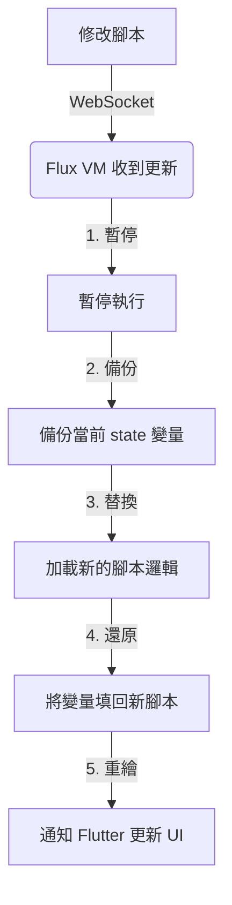

# Flutter 整合指南

[English Documentation](flutter_integration.md)

本指南將教你如何在 Flutter 應用中嵌入和使用 Flux 腳本。

## 1. 安裝與設定

在你的 Flutter 項目的 `pubspec.yaml` 中添加依賴：

```yaml
dependencies:
  flutter:
    sdk: flutter
  # 添加 Flux 依賴
  flux_vm: ^1.0.0
  flux_flutter: ^1.0.0
```

然後運行：
```bash
flutter pub get
```

---

## 2. 最基礎的用法 (FluxWidget)

`FluxWidget` 是核心組件，用於在 Flutter 界面中渲染 Flux 代碼。

### 顯示簡單文字

```dart
import 'package:flutter/material.dart';
import 'package:flux_flutter/flux_flutter.dart';

class MyScreen extends StatelessWidget {
  @override
  Widget build(BuildContext context) {
    return Scaffold(
      appBar: AppBar(title: Text("Flux 示例")),
      body: Center(
        child: FluxWidget(
          // 定義 Flux Widget 名稱
          widgetName: 'Greeting',
          // Flux 源代碼
          source: '''
            widget Greeting {
              build {
                return Text("你好，Flutter！");
              }
            }
          ''',
        ),
      ),
    );
  }
}
```

---

## 3. 狀態管理 (State)

Flux 擁有自己的狀態管理系統。當 `state` 變量改變時，UI 會自動更新。

### 計數器示例

```dart
FluxWidget(
  widgetName: 'Counter',
  source: '''
    widget Counter {
      // 定義狀態變量
      state count = 0;
      
      build {
        return Column(
          children: [
            Text("目前計數: " + count),
            
            // 按鈕觸發狀態改變
            Row(
              children: [
                Button(
                  text: "增加",
                  onTap: fn() { 
                    count = count + 1; 
                  }
                ),
                Button(
                  text: "減少",
                  onTap: fn() { 
                    count = count - 1; 
                  }
                )
              ]
            )
          ]
        );
      }
    }
  ''',
)
```

---

## 4. 支援的組件 (Widgets)

目前 Flux 支援以下基礎 Flutter 組件：

| Flux 組件 | 對應 Flutter | 屬性範例 |
|-----------|--------------|----------|
| `Text` | `Text` | `text: "Hello"`, `style: {...}` |
| `Button` | `ElevatedButton` | `text: "按我"`, `onTap: fn() {...}` |
| `Column` | `Column` | `children: [...]` |
| `Row` | `Row` | `children: [...]` |
| `Container` | `Container` | `padding: 10`, `color: "red"`, `child: ...` |
| `Image` | `Image.network` | `src: "https://..."` |
| `TextField` | `TextField` | `onChanged: fn(val) { ... }` |
| `Center` | `Center` | `child: ...` |

### 樣式示例

```dart
widget StyledBox {
  build {
    return Container(
      color: "blue",
      padding: 20,
      child: Text(
        text: "白色文字",
        style: {
          "color": "white",
          "fontSize": 24,
          "fontWeight": "bold"
        }
      )
    );
  }
}
```

---

## 5. 進階：Flutter 與 Flux 交互

### 從 Flutter 傳入初始數據

你可以通過 `initialState` 將數據傳入 Flux：

```dart
FluxWidget(
  widgetName: 'UserProfile',
  initialState: {
    'username': '小明',
    'level': 5
  },
  source: '''
    widget UserProfile {
      // 這些變量會被 initialState 初始化
      state username = "";
      state level = 0;
      
      build {
        return Text("用戶: " + username + " (Lv." + level + ")");
      }
    }
  ''',
)
```

---

## 6. 開發階段：熱重載 (Hot Reload)

Flux 支援開發時的即時**熱重載 (Hot Reload)**，讓你在調整 UI 時無需重啟 App。

### 步驟 1: 設置熱重載服務

在你的 Flutter `main.dart` 中：

```dart
void main() async {
  WidgetsFlutterBinding.ensureInitialized();
  
  // 連接到開發服務器 (模擬器用 10.0.2.2，真機用電腦 IP)
  final hotReload = await HotReloadService.connect('ws://127.0.0.1:8080');
  
  runApp(MyApp(hotReload: hotReload));
}
```

### 步驟 2: 使用 Flux CLI 啟動服務器 (在終端機)

```bash
# 監控 scripts 資料夾
flux dev --watch ./scripts
```
現在，當你修改 `./scripts` 中的 `.flux` 文件時，App 會自動更新！

### 實戰演練：體驗熱重載

*(略...見上文)*

---

## 7. 生產環境：熱更新 (Hot Update)

這就是大家常說的**「熱更新」** (或稱 OTA Updates, Code Push)。

### 什麼是熱更新？

與開發時的 "Hot Reload" 不同，**熱更新**是指在**應用發布上線後**，不通過 App Store / Play Store 審核，直接從伺服器下發新的邏輯和 UI 給用戶。

### 如何實現？

- **開發時 (Development)**：我們使用 `flux dev` 本地伺服器來實現秒級的 "Hot Reload"。
- **發布後 (Production)**：不需要 `flux dev`！你可以把 Flux 腳本放在**任何 HTTP 後端** (如 AWS S3, Firebase, 或你自己的 API)。

### 如何實現「雲端更新」功能？

在生產環境中，你只需要從網址下載腳本內容，然後傳給 `FluxWidget` 即可：

```dart
// 1. 從後端下載腳本
final response = await http.get(Uri.parse('https://api.myapp.com/events/halloween.flux'));
final scriptContent = response.body;

// 2. 顯示組件
return FluxWidget(
  widgetName: 'EventCard',
  source: scriptContent, // 直接使用下載的內容
);
```

### 實戰應用：為什麼這很重要？

想像你是運營經理，下週是萬聖節，你需要把首頁 Banner 換成南瓜主題並送出優惠券。

**傳統做法**：
1. 請工程師改代碼。
2. 提交 App Store 審核 (等待 1-2 天)。
3. 用戶更新 App。

**Flux 做法 (熱更新)**：
1. 運營人員更新後端的 `home_banner.flux` 腳本。
2. 用戶打開 App，自動下載新腳本。
3. **首頁立刻變成萬聖節主題，無需更新 App！**

#### 範例代碼：動態活動卡片

```dart
// home_banner.flux
widget EventCard {
  state themeColor = "orange";
  state discount = "50%";
  
  build {
    return Container(
      color: themeColor,
      padding: 16,
      child: Column(
        children: [
          Text("🎃 萬聖節特價！"),
          Text("全場 " + discount + " OFF"),
          Button(text: "領取優惠", onTap: fn() { print("領取成功"); })
        ]
      )
    );
  }
}
```

這就是 Flux 的核心價值：**極致的靈活性與運營效率。**

---

## 8. 技術原理：Flux 虛擬機機制

你可能會好奇，為什麼 Flux 可以做到即時熱更新而不需要重新編譯整個 App？

### 核心概念：資料 (Data) vs 代碼 (Code)

Flux 的魔法在於：**對 Flutter 而言，Flux 腳本只是「資料」而非「代碼」。**

1. **腳本即數據**：就像 Word 讀取 .docx 文件一樣，Flux VM 讀取 .flux 腳本。修改腳本對 App 來說只是換了一組數據，不需要重新編譯 Dart 代碼。
2. **虛擬機 (VM)**：`FluxWidget` 內部運行著一個微型虛擬機。當腳本改變時，VM 只是丟棄舊指令，加載新指令。
3. **狀態保留 (State Preservation)**：這是最關鍵的一點。Flux 的熱重載流程如下：



**結果**：你的應用邏輯變了（例如按鈕點擊從 `+1` 變成 `+10`），但你的數據還在（計數器還是保持在 `50`），這就是完美的熱重載體驗。

---

## 常見問題

### Q: 為什麼我的 UI 沒有更新？
A: 確保你修改的是 `state` 變量。只有 `state` 關鍵字聲明的變量才會觸發重繪。普通 `var` 變量不會。

### Q: 支援自定義 Flutter 組件嗎？
A: 支援！你可以在 `FluxBindings` 中註冊自己的 Flutter 組件供 Flux 使用。

```dart
// 在 Flutter 中註冊
FluxBindings.register('MyCustomWidget', (args, children) {
  return MyCustomFlutterWidget(
    title: args['title'],
  );
});

// 在 Flux 中使用
widget Demo {
  build {
    return MyCustomWidget(title: "測試");
  }
}
```
